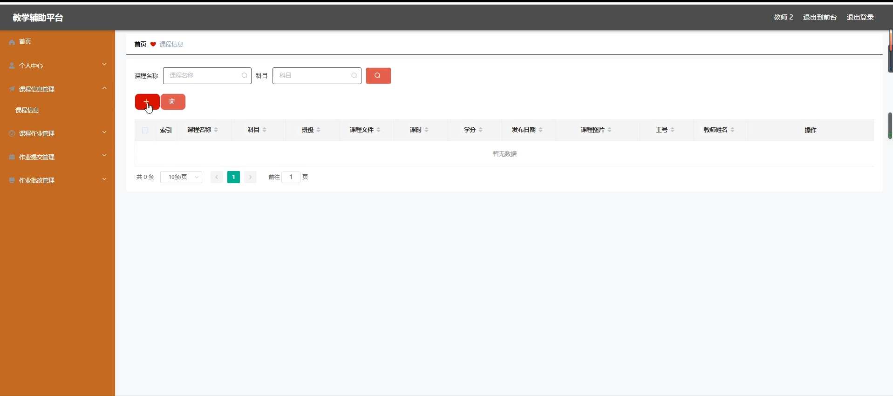
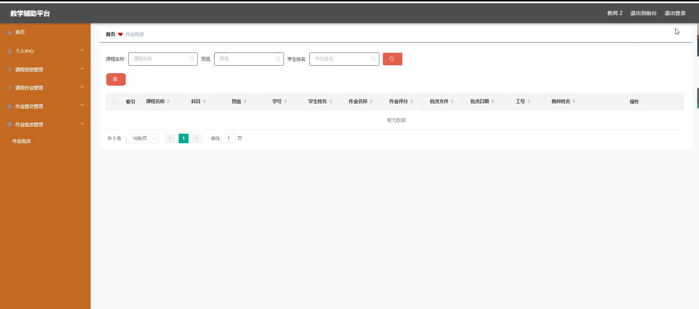
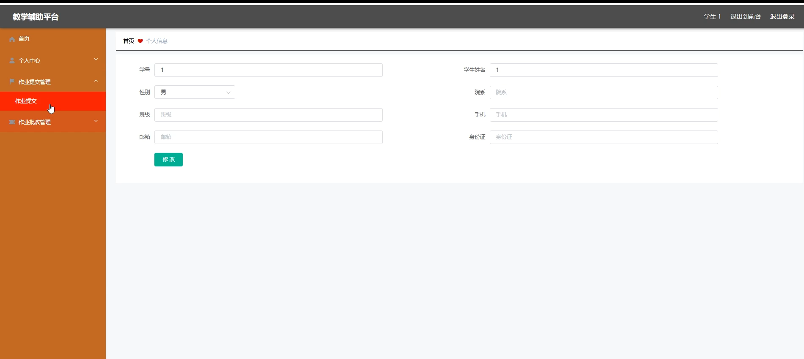

# 基于java的教学辅助平台

#### 介绍

随着健身行业的迅速发展，为了提高健身房的运营效率和服务质量，我们开发了这款基于 Spring Boot 的健身房管理系统。该系统旨在为健身房的管理者、教师和学生提供一个全面、高效、便捷的管理和交流平台，以实现健身房的科学化、规范化管理。

#### 技术栈

后端技术栈：Springboot+Mysql+Maven

前端技术栈：Vue+Html+Css+Javascript+ElementUI

开发工具：Idea+Vscode+Navicate

#### 系统功能介绍

（一）管理端  
个人中心：管理端用户可以在此查看和修改个人信息，接收重要通知和消息。  
学生管理：全面管理学生的信息，包括学生的基本资料、会员状态、课程报名情况等。可以对学生进行注册审批、信息修改、课程分配等操作。  
教师管理：负责教师的招聘、入职、离职等流程管理。记录教师的个人信息、教学资质、授课安排等。可以对教师进行绩效评估、权限设置和课程安排调整。  
课程信息管理：创建、编辑和管理健身房的课程信息，包括课程名称、课程描述、课程时长、适合人群等。可以设置课程的开课时间、授课教师和课程容量。  
科目分类管理：对健身房的课程科目进行分类，如瑜伽、有氧舞蹈、力量训练等，方便学生和教师进行选择和查找。  
班级分类管理：根据课程的难度、学员水平等因素对班级进行分类，如初级班、中级班、高级班等，实现精细化的教学管理。  
课程作业管理：布置和管理课程相关的作业，设定作业的提交时间、要求和评分标准。  
交流论坛：创建一个供学生、教师和管理人员交流的平台，方便大家分享经验、讨论问题和提出建议。  
系统管理：负责整个系统的配置、维护和升级，包括数据库管理、服务器监控、权限分配等，确保系统的稳定运行和数据安全。  

（二）教师端  
课程信息：教师可以查看自己负责的课程详细信息，包括课程安排、学生名单等。  
课程作业：布置、查看和批改学生的课程作业，了解学生的学习情况。  
交流论坛：参与论坛的讨论，与学生和其他教师进行交流互动，解答问题和分享教学心得。  
校园公告：及时获取健身房发布的重要通知和公告，了解健身房的最新动态和政策变化。  
个人中心：修改个人资料，查看自己的教学安排和绩效评估结果。  
后台管理：  
课程信息管理：可以对自己负责的课程信息进行调整和更新。  
课程作业管理：布置新的作业，修改已有的作业要求和评分标准。  
作业提交管理：查看学生的作业提交情况，督促未提交的学生及时完成作业。  
作业批改管理：对学生提交的作业进行批改和评分，给出反馈和建议。  

（三）学生端  
课程信息：浏览健身房的课程目录，查看课程详情和报名要求，选择自己感兴趣的课程进行报名。  
课程作业：接收教师布置的作业，按时完成并提交，查看作业批改结果和教师的反馈。  
交流论坛：在论坛中与教师和其他同学交流健身经验、学习心得和问题讨论。  
校园公告：了解健身房的最新通知和活动安排，以及与课程相关的重要信息。  
个人中心：修改个人信息，查看自己的课程报名记录和学习进度。  
后台管理：  
作业提交管理：提交完成的作业，查看作业提交历史和状态。  
作业批改管理：查看教师对自己作业的批改结果和评语。  

#### 系统作用

1. 提升管理效率  
为健身房管理者提供了集中、便捷的管理工具，实现了对学生、教师和课程的全面管理，大大提高了管理效率和决策的科学性。  
2. 优化教学质量  
教师能够更有效地组织教学活动、布置作业和批改作业，及时了解学生的学习情况，从而针对性地调整教学策略，提升教学质量。  
3. 增强学习体验  
学生可以方便地获取课程信息、完成作业和参与交流，更好地掌握健身知识和技能，提高学习的积极性和效果。  
4. 促进交流与合作  
交流论坛为学生、教师和管理者提供了一个开放的交流平台，促进了信息共享、经验交流和团队合作，营造了良好的学习氛围。  
5. 数据驱动决策  
系统积累的大量数据，如学生的学习情况、教师的教学效果、课程的受欢迎程度等，为健身房的发展规划和教学改进提供了有力的数据支持。  

#### 系统功能截图

代码结构

数据库表

登录

个人中心

教师端后台管理

作业提交管理

作业批改管理

前台页面首页

课程信息

课程作业

交流论坛

校园公告

学生端后台管理

管理员端教师管理

系统管理

#### 总结

基于 Spring Boot 的健身房管理系统通过清晰的角色划分和丰富实用的功能模块，实现了健身房管理和教学的信息化、规范化和智能化。它不仅满足了健身房日常运营和教学管理的需求，也为学生提供了优质的学习体验，为健身房的持续发展和服务提升奠定了坚实的基础。未来，我们将不断优化和完善系统功能，以适应不断变化的市场需求和技术发展。

#### 使用说明

创建数据库，执行数据库脚本 修改jdbc数据库连接参数 下载安装maven依赖jar 启动idea中的springboot项目

后台地址：http://localhost:8080/springboot59b1w/admin/dist/index.html

管理员  abo 密码 abo

前台地址：http://localhost:8080/springboot59b1w/front/index.html